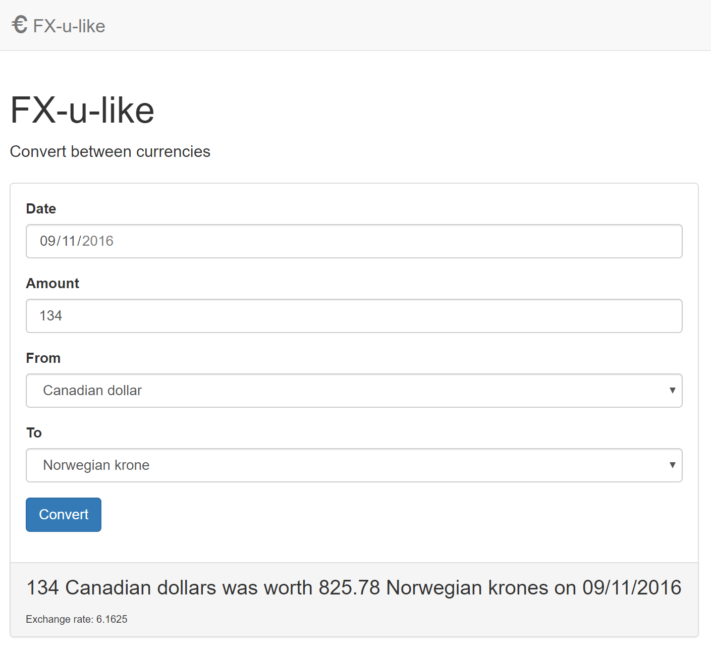

# README

FX-u-like for FreeAgent by [Martin Steel](mailto:martin@martinsteel.co.uk)




## Dependencies 

* Ruby 2.3.1 

All other dependencies are in the GemFile and should be installed using Bundler.

## To run

1. Install required Ruby Gems: 

    ```bundle install```

2. Set up database

    ```bundle exec rails db:migrate```

3. Download ECB currency feed: 

    ```bundle exec rails ecb:update_rates```

4. Run development server: 

    ```bundle exec rails server```

## Comments

* Rails is a bit over-the-top for this but it allowed me to try out the FreeAgent tech stack. Sinatra would've been a lighter weight choice.

* Web frontend tested in current release of Chrome
